# Sheet 1: System Architecture, Component Tree & Routing Matrix

## 1. High-Level Architecture Overview
EduCore OS is built on a clean, scalable multi-tier architecture:
- **Client (Frontend)**: React 18 + Vite with a Vanilla CSS design system, CSS glassmorphism, responsive grid layouts, and Lucide React icons.
- **REST API Middleware Engine (Backend)**: Node.js HTTP/HTTPS Server (`backend/server.js`) listening on port `8080` interfacing with Supabase PostgREST and PostgreSQL.
- **Database (Cloud)**: Supabase PostgreSQL relational database with automated schema caching, PostgREST RESTful APIs, foreign key relations, and role-based policies.

---

## 2. Multi-Role Portal Routing Architecture

### A. Authentication & Access Control (`Login.jsx`)
- **Master Admin (`role: 'admin'`)**: Full governance, institutional configuration, payroll, fee collection, RBAC permissions, faculty & student directory, class groups, leave/dispute approval desks.
- **Faculty / Teacher (`role: 'teacher'`)**: Homeroom cohort management, student roster, student attendance marking, student leave review, student dispute regularizations, faculty timecard punching, examination gradebook, progress remarks.
- **Student / Parent (`role: 'student'`)**: Monthly attendance calendar tracker, leave application desk, attendance regularization dispute desk, fee ledger & receipts, timetable routine, examination report cards.

---

## 3. Frontend Component & Sub-View Hierarchy

```mermaid
graph TD
    Root[main.jsx / App.jsx] --> Auth[Login.jsx]
    Root --> AdminPortal[Admin Console App.jsx]
    Root --> TeacherPortal[TeacherPortal.jsx]
    Root --> StudentPortal[StudentPortal.jsx]

    %% Admin Sub-Views
    AdminPortal --> Dash[Dashboard Overview & Action Queue]
    AdminPortal --> StuDir[Student Directory & Add/Edit Modals]
    AdminPortal --> ClassHub[ClassGroupsHub.jsx]
    AdminPortal --> TchDir[Faculty Directory & AssignFacultyModal.jsx]
    AdminPortal --> FeeDesk[Fee Collection & Receipts]
    AdminPortal --> SalDesk[Teacher Payroll & Pay-Slips]
    AdminPortal --> AttAdmin[AttendanceAdminView.jsx]
    AdminPortal --> GradeAdmin[GradebookAdminView.jsx]
    AdminPortal --> ExcelStudio[ExcelStudio.jsx]
    AdminPortal --> Rbac[RbacPermissionsView.jsx]
    AdminPortal --> StuGov[StudentGovernanceAdminView.jsx]
    AdminPortal --> TchGov[Teacher Leaves & Regularizations Desk]
    AdminPortal --> AdminNotifs[Admin Notification Drawer & SettingsModal.jsx]

    %% Teacher Sub-Views
    TeacherPortal --> Homeroom[Homeroom Cohort & Student Details Modal]
    TeacherPortal --> StudentRemarks[StudentRemarksModal.jsx]
    TeacherPortal --> TchTimecard[Teacher Daily Timecard & Attendance]
    TeacherPortal --> TchLeaveReg[Teacher Self Leave & Dispute Modals]
    TeacherPortal --> TchStuGov[Student Leave & Dispute Review Queues]
    TeacherPortal --> TchGradebook[Gradebook & Assessment Entry]

    %% Student Sub-Views
    StudentPortal --> CalTracker[StudentAttendanceCalendarTracker.jsx]
    StudentPortal --> StuLeaveModal[Leave Application Modal]
    StudentPortal --> StuRegModal[Attendance Regularization Modal Centered]
    StudentPortal --> StuLedger[Fee Ledger & Receipt Modal]
    StudentPortal --> StuGrades[Report Card & 10-Assessment Trends]
    StudentPortal --> StuTimetable[Timetable Routine & Faculty Directory]
```

---

## 4. State Management Matrix

| Portal / Component | Key State Variables | Sync Mechanism |
| :--- | :--- | :--- |
| **Admin Console** (`App.jsx`) | `students`, `teachers`, `classes`, `fees`, `salaries`, `studentLeaves`, `studentRegularizations`, `teacherLeaves`, `teacherRegularizations`, `allTimetable` | `loadAllData()` on tab change or event |
| **Student Governance** (`StudentGovernanceAdminView.jsx`) | `leaves`, `regularizations`, `statusFilter`, `searchQuery`, `selectedLeave`, `selectedReg` | `loadGovernanceData()` + `onRefreshAll()` |
| **Teacher Console** (`TeacherPortal.jsx`) | `students`, `classes`, `allLeaves`, `allRegularizations`, `timecardAttendance`, `timetable`, `studentGrades` | `loadTeacherData()` + periodic refresh |
| **Student Console** (`StudentPortal.jsx`) | `studentData`, `attendanceLogs`, `myLeaves`, `myRegularizations`, `myFees`, `myGrades`, `timetable` | `loadStudentData()` |
| **Attendance Tracker** (`StudentAttendanceCalendarTracker.jsx`) | `selectedMonthIdx`, `selectedYear`, `attendanceMap`, `showRegModal`, `regModalData` | Live date calculation & monthly filtering |
